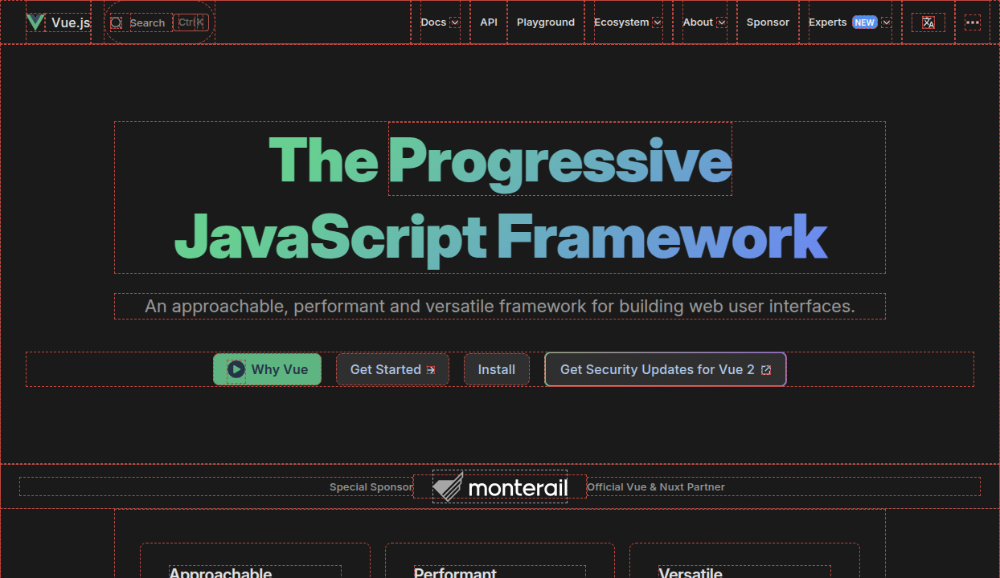

# Div Outline

A browser extension that helps web developers visualize HTML elements by toggling outlines on all page elements.

## Features

- Toggle outlines on/off with a single click
- Customizable outline color and style
- Works instantly on any active tab
- Lightweight with minimal performance impact

## Installation

1. Clone this repository or download the files
2. Open your browser's extension management page
   - Chrome: `chrome://extensions/`
   - Edge: `edge://extensions/`
   - Firefox: `about:addons`
3. Enable Developer Mode
4. Click "Load unpacked" (or equivalent) and select the extension folder

## Usage

1. Click on the Div Outline extension icon in your browser toolbar
2. Press the toggle button to enable/disable outlines on the current page
3. Visit the options page to customize the outline color and style

## Screenshot

## Customization

You can customize the extension through the options page:

- **Outline Color**: Choose any color that provides good contrast with your website's design
- **Outline Style**: Select from various styles like solid, dashed, dotted, etc.

## How It Works

This extension injects CSS into the active page to apply outlines to all HTML elements, making it easy to visualize the structure and layout of the page. The outlines can be toggled on and off with a single click, and they're fully customizable through the options page.

## Browser Compatibility

- Google Chrome
- Microsoft Edge
- Works with any Chromium-based browser that supports Manifest V3

## License

[MIT License](LICENSE)

## Contributing

Contributions are welcome! Feel free to open issues or submit pull requests.

## Version History

- 1.0: Initial release (April 2025)
  - Basic outline functionality
  - Customizable color and style options
